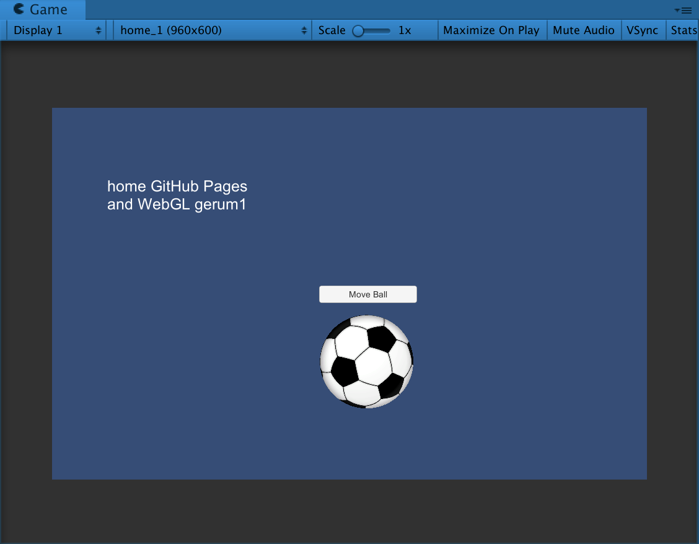

# home-WebGL-movingBall-cs-gerum1

### Project description: 
The project consists of a canvas (960x600), with a button, a text, four Empty Game Objects, a GameObject ball (imported) and a script 

When the button is pressed the ball moves randoly to one of four positions (PosBottomLeft, PosBottomRight, PosTopLeft, PosTopRight 

### Development platform: 
* Apple Mac OS; 
* Unity Version: 2019.1.14f1; 
* Visual Studio Version: Microsoft Visual Studio Code 2018;

### Target platform: 
WebGL incl. reference resolution 960x600 

### Visuals: 

### Third party material: 
<a href="https://de.wikipedia.org/wiki/Datei:Soccer_ball.svg">Ball Picture</a>

### Limitations: 
WebGL

### Lessons Learned: 
* make a GUI

Copyright by gerum1